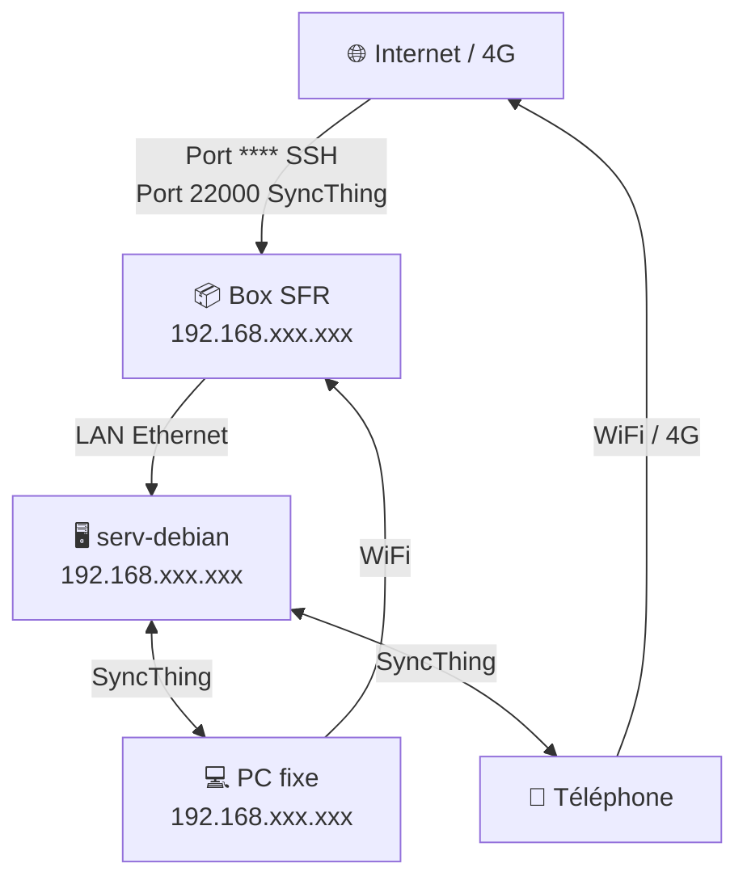

# Projet Serveur Home Lab — Debian sur vieux laptop

## Contexte et objectifs

L'objectif de ce projet était de reconvertir un ancien laptop Samsung NC10 en serveur domestique, capable de faire tourner SyncThing pour synchroniser mes fichiers entre mes appareils (PC fixe, téléphone, tablette, laptop), avec un accès sécurisé depuis l'extérieur du réseau local.

Les contraintes du projet étaient multiples : matériel très limité, absence de budget, et volonté de maintenir un bon niveau de sécurité malgré l'exposition partielle à internet.

---

## Matériel

| Composant    | Détail                                                              |
| ------------ | ------------------------------------------------------------------- |
| Machine      | Samsung NC10 (netbook ~2009)                                        |
| CPU          | Intel Atom N270 — 1,60 GHz (**32-bit uniquement**)                  |
| RAM          | 2 Go DDR2                                                           |
| Stockage     | HDD HGST 1 To (remplacé à une époque par un précédent propriétaire) |
| Connectivité | WiFi + port Ethernet (défaillant)                                   |
| BIOS         | Phoenix TrustedCore (legacy, pas d'UEFI)                            |

> Contrainte critique : CPU 32-bit L'Intel Atom N270 est un processeur **32-bit uniquement**. La quasi-totalité des distributions Linux modernes étant 64-bit, il a fallu choisir une distribution qui maintient encore un portage i386.

---

## Choix du système d'exploitation

Après analyse des distributions compatibles 32-bit encore maintenues, le choix s'est porté sur **Debian 12 "Bookworm" (i386)** pour les raisons suivantes :

- Maintient encore le portage `i386` officiel
- Réputation de stabilité maximale, idéale pour un serveur
- Grande communauté et documentation abondante
- Légèreté avec une installation sans environnement graphique

La version **DVD** (et non netinst) a été choisie pour permettre une installation hors-ligne, car je n'étais même pas sûr que la carte réseau ou le port ethernet était fonctionnels.

---

## Installation

### Création de la clé USB bootable

Utilisation de **Rufus 4.14** sous Windows avec les paramètres suivants :

- ISO : `debian-12.12.0-i386-DVD-1.iso`
- Schéma de partition : **MBR** (obligatoire pour le BIOS legacy Phoenix)
- Système de fichiers : FAT32

### Processus d'installation

L'installation s'est déroulée avec les choix suivants :

- Interface : **Install** (mode texte, plus léger que l'installation graphique sur ce CPU)
- Partitionnement : **Guided — use entire disk** (remplacement complet de Windows)
- Réseau : WiFi (le port Ethernet s'est avéré défaillant — voir problèmes rencontrés)
- Logiciels installés via tasksel : **SSH server** + **Standard system utilities** uniquement (aucun environnement graphique)
- Nom de la machine : `serv-debian`
- Grub installé sur `/dev/sda`

---

## Configuration post-installation

### Mise à jour des dépôts apt

Le DVD ISO configure apt avec une source `cdrom`, inutilisable une fois la clé USB retirée. Modification de `/etc/apt/sources.list` pour pointer vers les dépôts internet :

```bash
deb http://deb.debian.org/debian bookworm main non-free-firmware
deb http://security.debian.org/debian-security bookworm-security main non-free-firmware
```

Puis mise à jour du système (une fois connecté au réseau, la carte wifi étant fonctionnel):

```bash
apt update && apt upgrade
```

### Fermeture du couvercle sans mise en veille

Le laptop étant destiné à fonctionner couvercle fermé, modification de `/etc/systemd/logind.conf` :

```
HandleLidSwitch=ignore
```

---

## Santé du disque dur

Avant toute utilisation, vérification de l'état du HDD avec **smartmontools** :

```bash
apt install smartmontools
smartctl -a /dev/sda | grep -E "Reallocated_Sector|Current_Pending"
```

| Attribut SMART           | Valeur |
| ------------------------ | ------ |
| `Reallocated_Sector_Ct`  | 0 ✅    |
| `Current_Pending_Sector` | 0 ✅    |

Le disque ne présente aucun bad sector détecté.

> Risque de corruption via SyncThing Un HDD défaillant pourrait propager des fichiers corrompus via SyncThing sur tous les appareils. Pour ma base de donnée contenant les mots de passes, le format `.kdbx` inclut un hash d'intégrité SHA-256 qui détecte toute corruption avant ouverture. En complément, le **versioning SyncThing** (mode Staggered, rétention illimitée) a été activé sur le dossier KeePassXC. Pour prévenir les risques de corruption ou même d'autres problèmes.

---

## Installation et configuration de SyncThing

### Installation

Ajout du dépôt officiel SyncThing et installation :

```bash
curl -s https://syncthing.net/release-key.txt | gpg --dearmor -o /usr/share/keyrings/syncthing-archive-keyring.gpg
echo "deb [signed-by=/usr/share/keyrings/syncthing-archive-keyring.gpg] https://apt.syncthing.net/ syncthing stable" > /etc/apt/sources.list.d/syncthing.list
apt update && apt install syncthing
```

### Service systemd

SyncThing est configuré pour tourner en tant qu'utilisateur non-privilégié et se lancer automatiquement au démarrage :

```bash
systemctl enable syncthing@user.service
systemctl start syncthing@user.service
```

### Interface web

Par défaut, SyncThing n'écoute que sur `localhost`. Modification de `/home/user/.local/state/syncthing/config.xml` pour l'exposer sur le réseau local :

```xml
<address>0.0.0.0:8384</address>
```

L'interface est accessible sur `http://<SERVER_IP>:8384` depuis le réseau local. Un mot de passe a été configuré sur l'interface web.

### Structure des dossiers

Les dossiers synchronisés sont stockés dans `/home/user/Sync/`, avec un sous-dossier par usage (KeePassXC, Obsidian vault, etc.).

---

## Réseau et connectivité

### Problème d'isolation WiFi

Ma box SFR présente une **isolation AP** entre les appareils WiFi, empêchant toute communication directe entre le serveur et le PC. Cette option n'étant pas configurable via l'interface d'administration, la solution a été de connecter le serveur en filaire.

### Défaillance du port Ethernet intégré

Le port Ethernet intégré du laptop s'est avéré défaillant (état `NO-CARRIER` malgré le branchement). La solution a été de tester un autre port LAN de la box, qui a fonctionné, révélant que le problème venait d'un port LAN de la box et non du laptop.

### Configuration réseau finale

| Interface | Nom      | IP             | État                |
| --------- | -------- | -------------- | ------------------- |
| Ethernet  | `enp3s0` | `<SERVER_IP>` | Principal (utilisé) |
| WiFi      | `wlp2s0` | `<SERVER_IP>` | Secondaire          |

### Réservation DHCP

Pour garantir une IP fixe au serveur, une réservation DHCP a été configurée dans la box SFR :

- **MAC** : `00:**:**:**:**:**` (interface `enp3s0`)
- **IP réservée** : `<SERVER_IP>`

---

## Sécurisation

### SSH

Le port SSH a été changé du port standard (`22`) vers un autre dans `/etc/ssh/sshd_config` :

```
Port ****
```

(Censuré ici)
Ce changement élimine la grande majorité des bots malveillants qui scannent uniquement le port 22.

### Authentification par clé SSH

Génération d'une paire de clés Ed25519 sur le PC client :

```powershell
ssh-keygen -t ed25519 -C "serv-debian"
```

Copie de la clé publique sur le serveur :

```powershell
type $env:USERPROFILE\.ssh\id_ed25519.pub | ssh -p **** user@<SERVER_IP> "mkdir -p ~/.ssh && cat >> ~/.ssh/authorized_keys"
```

### Désactivation de l'authentification par mot de passe

Une fois les clés en place et testées, désactivation de l'authentification par mot de passe et du login root direct dans `/etc/ssh/sshd_config` :

```
PasswordAuthentication no
PermitRootLogin no
```

### Fail2ban

Installation et configuration de Fail2ban pour bloquer les IPs effectuant trop d'échecs de tentatives de connexion :

```bash
apt install fail2ban
```

Configuration dans `/etc/fail2ban/jail.local` :

```ini
[sshd]
enabled = true
port = ****
maxretry = 5
bantime = 1h
backend = systemd
```

> Pourquoi `backend = systemd` ? Sur Debian 12, SSH log dans journald et non dans un fichier texte classique. Sans ce paramètre, Fail2ban ne trouve pas les logs SSH et refuse de démarrer.

---

## Port forwarding

Pour permettre l'accès au serveur depuis l'extérieur du réseau local (connexion 4G), deux règles de redirection de port ont été configurées dans la box SFR (Réseau v4 → NAT) :

| Service   | Protocole | Port externe | IP destination | Port destination |
| --------- | --------- | ------------ | -------------- | ---------------- |
| SSH       | TCP       | ****         | <SERVER_IP>   | ****             |
| SyncThing | TCP + UDP | 22000        | <SERVER_IP>   | 22000            |

L'IP publique de la box ayant été vérifiée (pas de CGNAT côté SFR), le port forwarding fonctionne correctement.

---

## Monitoring

### Cockpit

Installation de **Cockpit** pour un monitoring visuel accessible depuis le navigateur :

```bash
apt install cockpit
systemctl start cockpit
```

Interface accessible sur `http://<SERVER_IP>:9090`. Cockpit permet de surveiller en temps réel :

- Utilisation CPU et RAM
- Espace disque
- Trafic réseau
- État des services systemd
- Logs système
- Terminal intégré

### Température

La température au repos du CPU Atom N270 est de ~64°C, ce qui est élevé et indique une pâte thermique à changer, ce qui a été fait par la suite.

```bash
cat /sys/class/thermal/thermal_zone0/temp
```

---

## Mises à jour automatiques de sécurité

Les mises à jour de sécurité automatiques ont été activées pour maintenir le système à jour sans intervention manuelle.

---

## Problèmes rencontrés et solutions

> CPU 32-bit — distributions incompatibles **Problème** : L'Atom N270 étant 32-bit, impossible d'installer une distribution 64-bit standard. **Solution** : Utilisation de Debian 12 i386, l'un des rares systèmes modernes maintenant encore ce portage.

> Port Ethernet de la box défaillant **Problème** : Le port LAN 3 de la box ne donnait pas de signal (LED éteinte, `NO-CARRIER`). **Solution** : Utilisation du port LAN 2, qui fonctionne correctement.

> Isolation WiFi de la box SFR **Problème** : Les appareils WiFi ne peuvent pas communiquer entre eux directement — le PC ne pouvait pas joindre le serveur en WiFi. **Solution** : Connexion filaire du serveur, contournant totalement l'isolation WiFi.

> Fail2ban ne démarre pas — logs SSH introuvables **Problème** : `ERROR: Failed during configuration: Have not found any log file for sshd jail` **Solution** : Ajout de `backend = systemd` dans `jail.local`, car Debian 12 utilise journald et non des fichiers de log classiques.

> SyncThing non accessible depuis le réseau **Problème** : SyncThing écoutait sur `127.0.0.1:8384` (localhost uniquement). **Solution** : Modification de `config.xml` pour écouter sur `0.0.0.0:8384`.

---

## Architecture finale



---

## État actuel du projet

**Fonctionnel :**

- [x] Debian 12 i386 installé et à jour
- [x] SyncThing opérationnel avec versioning activé
- [x] SSH sécurisé (clés Ed25519, port non-standard, root désactivé)
- [x] Fail2ban actif
- [x] Port forwarding SSH et SyncThing
- [x] IP fixe via réservation DHCP
- [x] Cockpit pour le monitoring
- [x] Mises à jour de sécurité automatiques
- [x] Remplacer la pâte thermique (température CPU trop élevée au repos)
- [x] Installer Pi-hole pour bloquer les publicités à l'échelle du réseau (réalisé une semaine après)

---

## Images du projet


